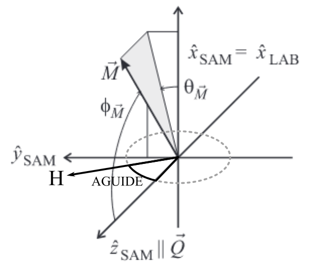

# Validation
Tests for reflectivity calculations
(from Andrew Nelson: https://github.com/andyfaff/orso)

## Polarised tests
### Coordinate system: Refl1D
The coordinate system used by Refl1D is based on the book chapter "Polarized Neutron Reflectometry" [^1] by C. F. Majkrzak et al. and is defined as seen in this figure: 

The Sample coordinate system is defined such that the surface normal (parallel to Q) is _zSample_, and then _xSample_  and _ySample_ are in the sample plane.

The Lab coordinate system is defined so that _zLab_ points along the polarisation (guide field = _H_) direction.

Further, _xLab_ is defined to be the same as _xSample_.  Thus _xSample_ is a unit vector in the sample plane (perpendicular to Q) that is also perpendicular to the guide field _H_. _ySample_, _yLab_ are then derived from the right-hand-rule from the _x,z_ components in their respective reference frames, and importantly _H_ is then always in the sample _y,z_ plane.

The angle between _zSample_ and _zLab_ we call _AGUIDE_, and the angle between _xSample_ and the in-plane component of the sample magnetization (_MIP_) is _thetaM_.

Because of the way the reference frames are defined, there are always (at least) two valid choices for the direction of _xSample_.
For some common geometries, here are some corresponding angles:
#### Guide field H in sample plane (perpendicular to Q)
For e.g. a vertical-axis right-handed reflectometer, when the guide field at sample points up

 - _AGUIDE_ = pi/2
 - _thetaM_ = pi/2 for _MIP_ || _H_

#### Guide field H || Q
Where the guide field is normal to the surface:
 - _AGUIDE_ = 0
 - _thetaM_ is not constrained (any choice of _xSample_ is equally valid), and does not contribute to the calculation of the scattering

[^1]:Majkrzak, C. F., K. V. O'Donovan, and N. F. Berk. "Polarized neutron reflectometry." In Neutron Scattering from Magnetic Materials, pp. 397-471. Elsevier Science, 2006.